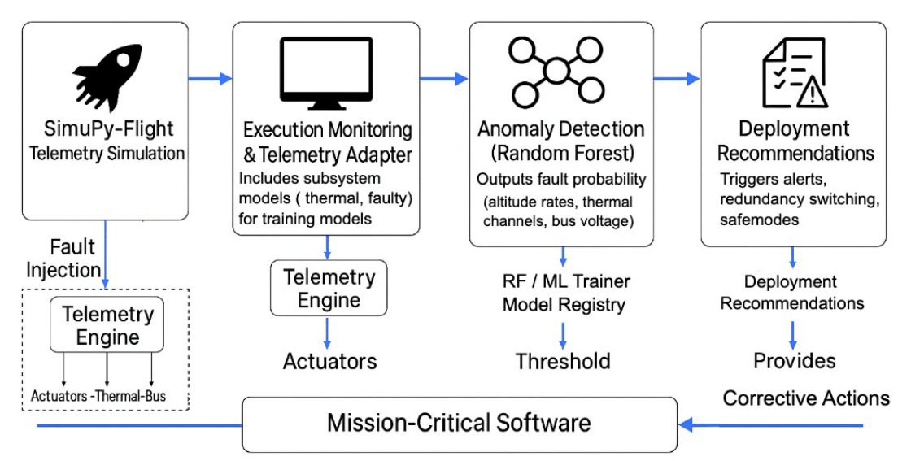

# 🚀 NASA SimuPy Spacecraft AI Fault Diagnostics  
### *AI-Driven Fault Detection & Reliability Diagnostics for Spacecraft Using NASA SimuPy-Flight and Random Forest*


[](https://doi.org/10.5281/zenodo.17626179)

---

## **Abstract**

Modern spacecraft rely heavily on autonomous onboard software to ensure safe guidance, navigation, control, thermal balance, power stability, and communications.  
Small deviations in telemetry can indicate critical faults that must be detected early.

This repository contains the **complete implementation** for our paper:

### **AI-Driven Fault Detection & Reliability Diagnostics for Spacecraft Using SimuPy and Random Forest**  
*(Submitted to the IEEE Aerospace Conference, 2026 – Montana)*

The framework integrates:  
- **NASA's SimuPy-Flight Vehicle Toolkit** for high-fidelity dynamics  
- **Random Forest–based anomaly detection**  
- **Telemetry simulation + fault injection**  
- **Real-time fault-probability estimation**  
- **Mission-critical feedback loop**  
- **Reproducible metrics and figures (PR/ROC, confusion matrix, feature importances)**

All results in the paper can be reproduced exactly using this repository.

---

## 🛰 **System Architecture**

The following diagram represents the full processing pipeline used throughout the experiments:

> *(Insert your generated architecture diagram here as `figures/architecture.png`)*  
> Example:  
> ```md
> 
> ```

---

##  **Repository Structure**

The following diagram illustrates the end-to-end pipeline:

             ┌────────────────────┐
             │ NASA SimuPy-Flight │
             │  (Vehicle Model)   │
             └─────────┬──────────┘
                       │ Telemetry Stream
                       ▼
            ┌────────────────────────┐
            │ Telemetry Generator    │
            │ (Signal Extraction)    │
            └─────────┬──────────────┘
                      │
                      ▼
            ┌────────────────────────┐
            │ Fault Injection Engine │
            │  bias | drift | dropout│
            └─────────┬──────────────┘
                      │
                      ▼
            ┌────────────────────────┐
            │ Dataset Builder (CSV)  │
            └─────────┬──────────────┘
                      │
                      ▼
            ┌────────────────────────┐
            │ Machine Learning (RF)  │
            │  Fault Classification  │
            └─────────┬──────────────┘
                      │
                      ▼
     ┌──────────────────────────────────────┐
     │ Runtime Fault Monitor (probability)  │
     └──────────────────────────────────────┘


---

## **Repository Structure**

```plaintext
Spacecraft_AI_Fault_Diagnostics/
│
├── data/
│   └── simupyflight/         # Generated telemetry + fault datasets
│
├── framework/
│   ├── adapters/
│   │   └── simupy_flight_adapter.py  # NASA SimuPy-Flight integration
│   ├── telemetry_generator.py         # Extracts signals from SimuPy
│   ├── faults.py                      # Fault injection (bias, drift, dropout)
│   ├── dataset_builder.py             # Generates structured CSV datasets
│   ├── random_forest_model.py         # RF training + evaluation
│   └── runtime_monitor.py             # Real-time classification
│
├── scripts/
│   ├── generate_dataset.py            # CLI: run SimuPy-Flight + faults
│   ├── train_rf.py                    # Train Random Forest classifier
│   └── probe_sf_stream.py             # Test SimuPy-Flight streaming
│
├── figures/
│   ├── architecture.png
│   ├── confusion_matrix.png
│   └── feature_importance.png
│
├── requirements.txt
└── README.md ```


## ** Installation**

### **1. Clone repository**
git clone https://github.com/<your-username>/Spacecraft_AI_Fault_Diagnostics  
cd Spacecraft_AI_Fault_Diagnostics

### **2. Create virtual environment**
python3 -m venv .venv

### **3. Activate environment**

**Mac / Linux**  
source .venv/bin/activate

**Windows PowerShell**  
.venv\Scripts\Activate.ps1

### **4. Install dependencies**
pip install --upgrade pip  
pip install -r requirements.txt

### **Minimum dependencies**
simupy  
simupy-flight  
numpy  
pandas  
scikit-learn  
matplotlib

---

## ** Usage**

### **1. Run NASA SimuPy-Flight Streaming Probe**
python -m scripts.probe_sf_stream --hz 10 --seconds 5

**With fault injection:**  
python -m scripts.probe_sf_stream --hz 10 --seconds 5 --fault bias

---

### **2. Generate Dataset (SimuPy + Fault Injection)**
python -m scripts.generate_dataset \
    --from-simupyflight \
    --cycles 30 \
    --fault-types bias drift dropout \
    --output data/simupyflight/

**Output files include:**  
raw_telemetry.csv  
fault_injected.csv  
labels.csv  
metadata.json

---

### **3. Train Random Forest Classifier**
python -m scripts.train_rf --input data/simupyflight/

**Produces:**  
rf_model.pkl  
confusion_matrix.png  
feature_importance.png

---

### **4. Run Real-Time Fault Monitor**
python -m framework.runtime_monitor --model rf_model.pkl

---

## ** Experimental Results (Placeholder)**

| Metric     | Value |
|------------|-------|
| Accuracy   | TBD   |
| Precision  | TBD   |
| Recall     | TBD   |
| F1 Score   | TBD   |

---

## ** How to Cite**

### **NASA SimuPy-Flight Toolkit**  
NASA Engineering and Safety Center (NESC), ARC-18618-1.

### **This Work**
V. S. Devarajulu, "AI-Driven Fault Detection & Reliability Diagnostics for Spacecraft Using SimuPy and Random Forest," IEEE Aerospace Conference, Montana, 2026.

**DOI:** https://doi.org/10.5281/zenodo.17626179

---

## ** Acknowledgments**
This work uses NASA’s SimuPy-Flight Vehicle Toolkit, enabling open and reproducible aerospace simulation research.


(GitHub: Vishnupriya-Navigator)
