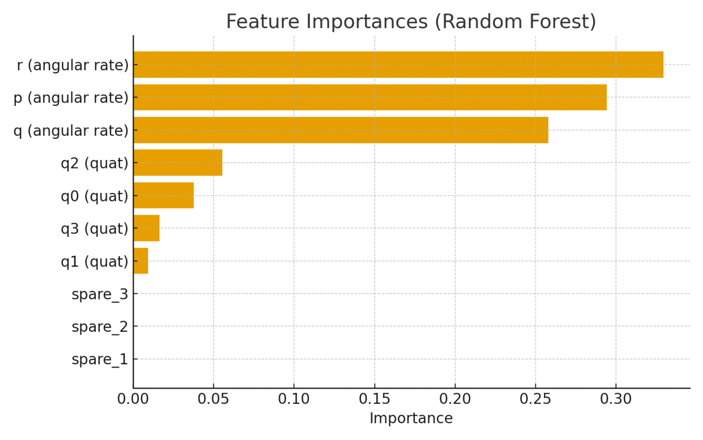
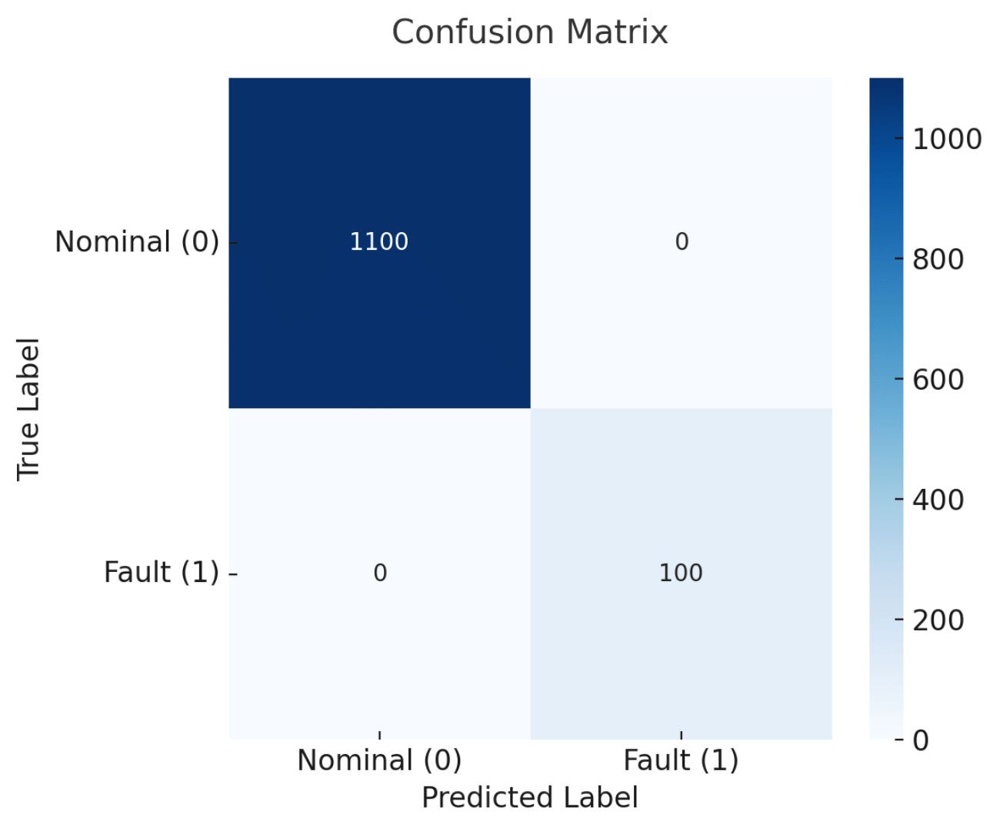
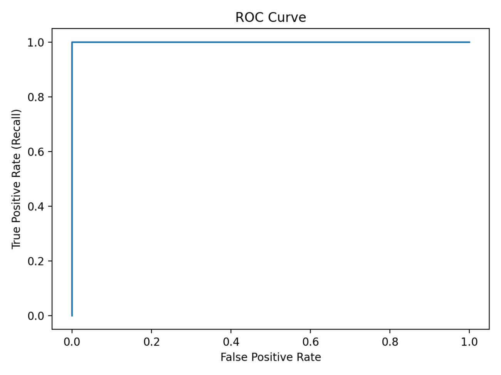
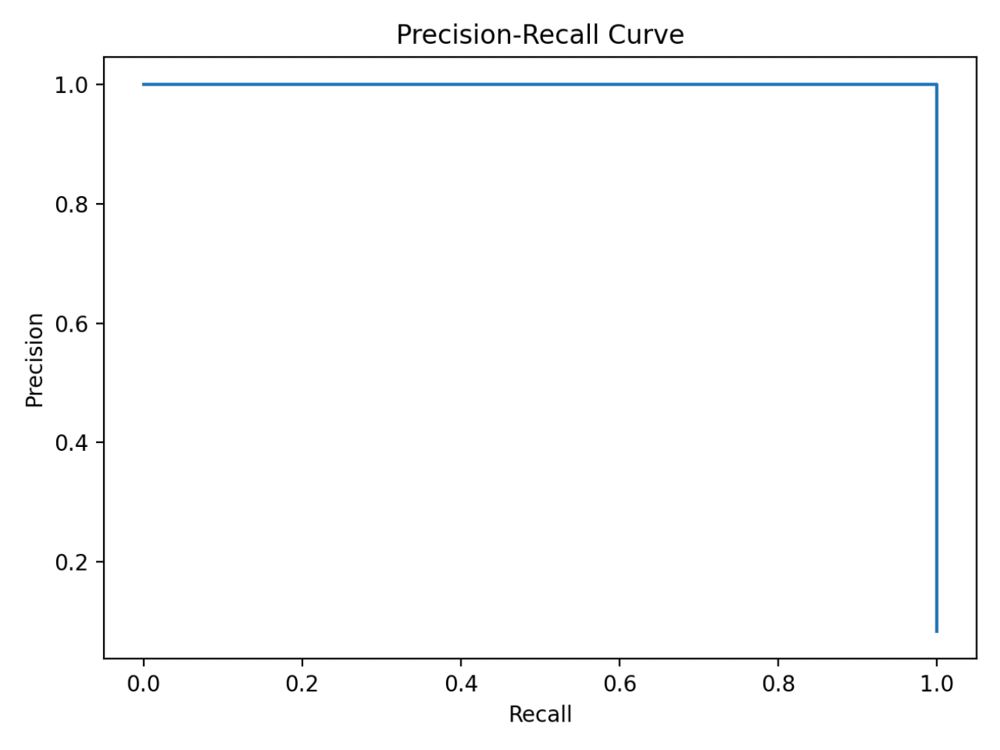
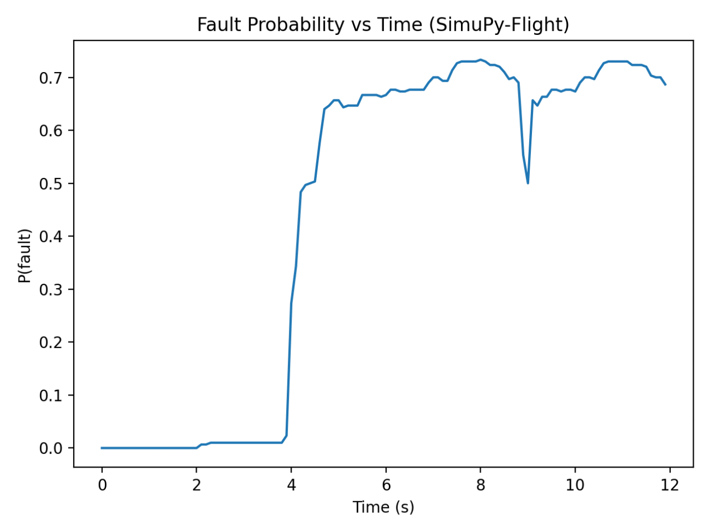
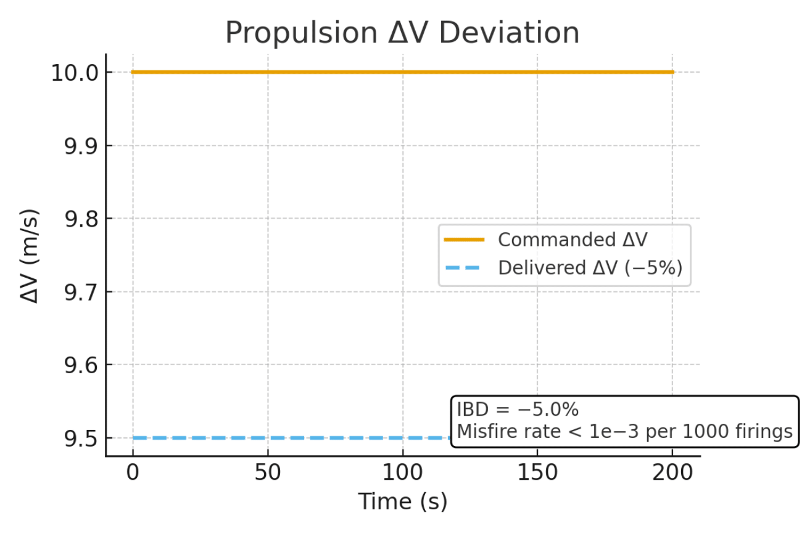
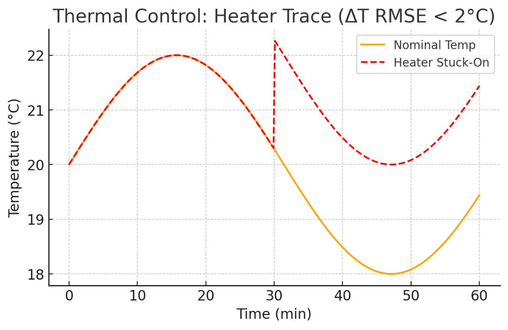
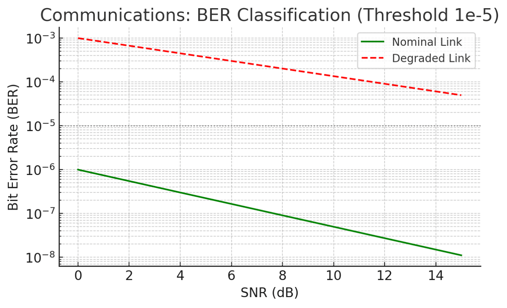
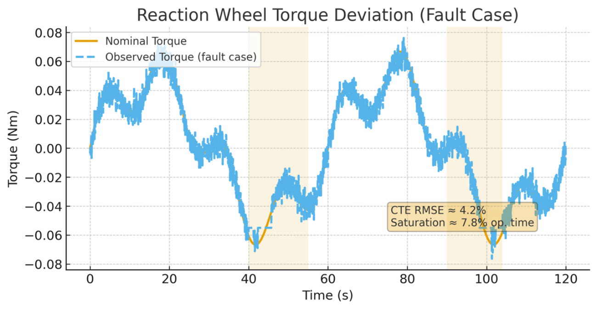
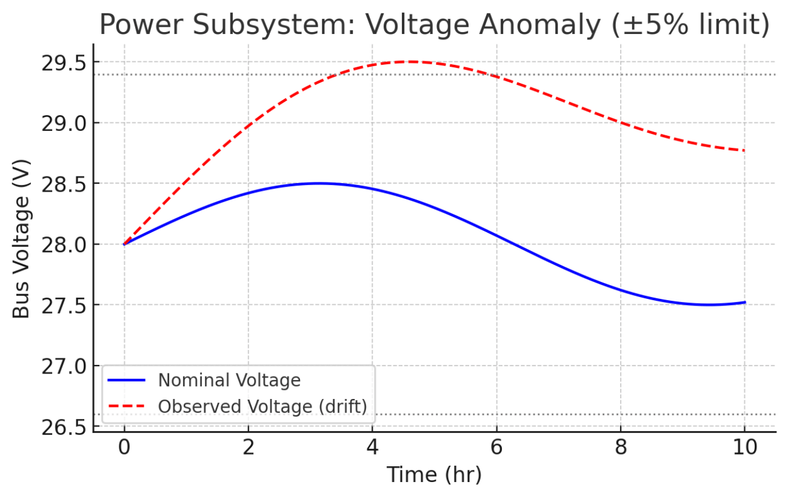

# NASA SimuPy Spacecraft AI Fault Diagnostics
### *AI-Driven Fault Detection & Reliability Diagnostics for Spacecraft Using NASA SimuPy-Flight and Random Forest*


[](https://doi.org/10.5281/zenodo.17626179)

---

## **1. Abstract**

Modern spacecraft rely heavily on autonomous onboard software to ensure safe guidance, navigation, control, thermal balance, power stability, and communications.  
Small deviations in telemetry can indicate critical faults that must be detected early.

### **AI-Driven Fault Detection & Reliability Diagnostics for Spacecraft Using SimuPy and Random Forest**  
*(Submitted to the IEEE Aerospace Conference, 2026 – Montana)*

The framework integrates:  
- **NASA's SimuPy-Flight Vehicle Toolkit** for high-fidelity dynamics  
- **Random Forest–based anomaly detection**  
- **Telemetry simulation + fault injection**  
- **Real-time fault-probability estimation**  
- **Mission-critical feedback loop**  
- **Reproducible metrics and figures (PR/ROC, confusion matrix, feature importances)**

All results in the paper can be reproduced exactly using this repository.

---

## **2. System Architecture**

Figure 1 illustrates the high-level architecture of the framework.

**Figure 1 – System Architecture**


At a high level, the system operates as follows:

1. **SimuPy-Flight Vehicle Simulation**  
   A NASA SimuPy-Flight attitude-dynamics case is executed to simulate spacecraft motion, producing raw telemetry streams (e.g., angular rates, quaternion attitude).

2. **Telemetry Extraction Layer**  
   Selected signals are extracted and normalized into a consistent tabular format. This layer can be extended to add additional subsystems (e.g., power, thermal, communications).

3. **Fault Injection Engine**  
   Controlled synthetic faults are injected into the telemetry to emulate realistic anomalies, enabling supervised learning with ground-truth labels.

4. **Dataset Builder**  
   Telemetry and fault labels are merged into a consolidated dataset suitable for training and evaluation of the Random Forest classifier.

5. **Random Forest Fault Classifier**  
   A Random Forest model is trained to discriminate between nominal and faulty behavior and provide fault probabilities.

6. **Runtime Monitor**  
   A light-weight runtime module consumes telemetry streams and emits fault predictions and associated probabilities. This component is designed for potential integration into onboard fault management or ground-based monitoring systems.

---

##  **3. Pipeline Structure**

The following diagram represents the processing pipeline:

```text
             ┌────────────────────┐
             │ NASA SimuPy-Flight │
             │  (Vehicle Model)   │
             └─────────┬──────────┘
                       │ Telemetry Stream
                       ▼
            ┌────────────────────────┐
            │ Telemetry Generator    │
            │ (Signal Extraction)    │
            └─────────┬──────────────┘
                      │
                      ▼
            ┌────────────────────────┐
            │ Fault Injection Engine │
            │  bias | drift | dropout│
            └─────────┬──────────────┘
                      │
                      ▼
            ┌────────────────────────┐
            │ Dataset Builder (CSV)  │
            └─────────┬──────────────┘
                      │
                      ▼
            ┌────────────────────────┐
            │ Machine Learning (RF)  │
            │  Fault Classification  │
            └─────────┬──────────────┘
                      │
                      ▼
     ┌──────────────────────────────────────┐
     │ Runtime Fault Monitor (probability)  │
     └──────────────────────────────────────┘

```
---

## **4. Repository Structure**

```plaintext
Spacecraft_AI_Fault_Diagnostics/
│
├── data/
│   └── simupyflight/                 # Generated telemetry + fault datasets
│
├── framework/
│   ├── adapters/
│   │   └── simupy_flight_adapter.py  # NASA SimuPy-Flight integration
│   ├── telemetry_generator.py        # Extracts signals from SimuPy
│   ├── faults.py                     # Fault injection (bias, drift, dropout)
│   ├── dataset_builder.py            # Generates structured CSV datasets
│   ├── random_forest_model.py        # RF training + evaluation
│   └── runtime_monitor.py            # Real-time classification
│
├── scripts/
│   ├── generate_dataset.py           # CLI: run SimuPy-Flight + faults
│   ├── train_rf.py                   # Train Random Forest classifier
│   └── probe_sf_stream.py            # Test SimuPy-Flight streaming
│
├── figures/
│   ├── architecture.png              # System architecture diagram
│   ├── confusion_matrix.png          # RF confusion matrix
│   └── feature_importance.png        # RF feature importance bar chart
│
├── requirements.txt
└── README.md
```
---

## **5. Installation**

### **. Clone repository**
```bash
git clone https://github.com/<your-username>/Spacecraft_AI_Fault_Diagnostics
cd Spacecraft_AI_Fault_Diagnostics
```

### ** Create virtual environment**
```bash
python3 -m venv .venv
```

### ** Activate environment**

**Mac / Linux**
```bash
source .venv/bin/activate
```

**Windows PowerShell**
```powershell
.venv\Scripts\Activate.ps1
```

### ** Install dependencies**
```bash
pip install --upgrade pip
pip install -r requirements.txt
```

---

## 6. Usage

This section summarizes the typical end-to-end workflow used in the paper.

### 6.1 Probe SimuPy-Flight telemetry

Use the probe script to verify that SimuPy-Flight can be executed and that telemetry is accessible:

```bash
python -m scripts.probe_sf_stream --hz 10 --seconds 5
```

To include a simple example of fault injection in the stream:

```bash
python -m scripts.probe_sf_stream --hz 10 --seconds 5 --fault bias
```

This step is primarily for validation and debugging; the main dataset generation path is described below.

### 6.2 Generate labeled dataset (SimuPy + fault injection)

The dataset generation script runs SimuPy-Flight, applies configured fault injections, and writes labeled CSV files:

```bash
python -m scripts.generate_dataset     --from-simupyflight     --cycles 30     --fault-types bias drift dropout     --output data/simupyflight/
```

Typical outputs include:

- `raw_telemetry.csv` – baseline signals from SimuPy-Flight.  
- `fault_injected.csv` – telemetry after applying fault injection operators.  
- `labels.csv` – binary or multi-class labels indicating nominal vs. fault conditions.  
- `metadata.json` – configuration details (fault timing, magnitude, seed, etc.).  

### 6.3 Train Random Forest classifier

Once the dataset is generated, the Random Forest model can be trained:

```bash
python -m scripts.train_rf --input data/simupyflight/
```

This script trains the classifier and typically produces:

- `rf_model.pkl` – serialized Random Forest model.  
- `confusion_matrix.png` – confusion matrix for the evaluation set.  
- `feature_importance.png` – global feature importance ranking produced by the model.  

### 6.4 Run runtime fault monitor

The runtime monitor consumes live or replayed telemetry, loads the trained model, and prints/logs fault probabilities:

```bash
python -m framework.runtime_monitor --model rf_model.pkl
```

The monitor is designed to be lightweight and interpretable, making it suitable for further integration into an onboard fault management system or ground-based monitoring console.

---

## 7. Experimental Setup and Methodology

The methodology implemented in this repository is aligned with the paper and can be summarized as follows:

1. **Simulation environment**  
   A SimuPy-Flight attitude dynamics model is used as the primary source of telemetry. The simulation is configured to produce representative rotational motion and associated state variables.

2. **Telemetry selection and preprocessing**  
   The telemetry pipeline selects key variables such as angular rates (p, q, r) and quaternion attitude components. Signals are optionally normalized or transformed prior to model training.

3. **Fault taxonomy and injection**  
   The fault engine supports multiple classes of spacecraft-like anomalies, including:
   - Bias faults (step changes in sensor readings)  
   - Drift faults (slow, time-dependent deviation)  
   - Dropout (temporary loss of signal)  
   - Additional fault modes (spike, saturation, etc.) can be added in `faults.py`.

   Faults are applied over specified time windows, with parameters documented in `metadata.json` for reproducibility.

4. **Dataset construction**  
   The dataset builder merges nominal and faulty segments, constructs feature vectors, and assigns labels. The resulting dataset can be used for both supervised classification and analysis of feature relevance.

5. **Model training and validation**  
   A Random Forest classifier is used as the primary model due to its:
   - Robust performance on tabular telemetry data.
   - Ability to handle nonlinear decision boundaries.
   - Interpretability via feature importance metrics.

6. **Runtime evaluation**  
   The runtime monitor simulates deployment conditions by processing telemetry streams and generating fault probabilities over time. This allows measurement of:
   - Detection latency.
   - False alarm rate.
   - Stability of predictions in the presence of noise.

For detailed derivations, assumptions, and additional experimental context, refer to the full paper.

---

## 8. Results

The following metrics are representative of the results reported in the associated paper for the evaluated scenarios.

### 8.1 Classification metrics

**Table 1 – Classification performance (example configuration)**

| Metric             | Result        |
|--------------------|--------------|
| ROC-AUC            | 1.000        |
| PR-AUC             | 1.000        |
| Detection latency  | ≈ 0.70 s     |
| False alarm rate   | 0 per hour   |
| Confusion matrix   | 0 FP / 0 FN  |

### 8.2 Figures

**Figure 2 – Feature Importances (Random Forest)**  


This figure highlights the most influential features contributing to the RF decisions, enabling subsystem-level interpretability.

**Figure 3 – Confusion Matrix**  


The confusion matrix provides a visual summary of classification performance over the evaluation set.

If additional figures (e.g., ROC curves, PR curves, probability vs. time) are produced during experimentation, they should be added to `figures/` and referenced here with appropriate captions.

### Figure 4 — ROC Curve


### Figure 5 — Precision-Recall Curve


### Figure 6 — Fault Probability vs Time


### Figure 7 — Propulsion Deviation


### Figure 8 — Thermal Control


### Figure 9 — BER Classification


### Figure 10 — Torque Deviation


### Figure 11 — Voltage Anomaly


---

## 9. Reproducibility Guide

This section provides a canonical sequence of commands to reproduce the core results.

### 9.1 Generate nominal and faulty telemetry

```bash
python -m scripts.generate_simupy_dataset --seconds 60 --hz 50 --out data/raw/sf_nominal.csv

python -m scripts.generate_simupy_dataset --seconds 60 --hz 50     --fault bias --fault-start 10 --fault-end 20     --out data/raw/sf_bias.csv
```

(Adjust durations, sampling frequency, and fault parameters as required.)

### 9.2 Merge datasets and build final training set

```bash
python -m scripts.generate_dataset
```

### 9.3 Train the Random Forest model

```bash
python -m scripts.train_rf
```

### 9.4 Evaluate the model

```bash
python -m scripts.evaluate
```

### 9.5 Generate PR and ROC curves (if implemented)

```bash
python -m scripts.metrics_roc_pr
```

### 9.6 Measure latency and false alarm rate

```bash
python -m scripts.latency_eval
python -m scripts.false_alarm_rate
```

---

## 10. Limitations and Future Work

- The current implementation focuses primarily on attitude-dynamics telemetry. Extending the adapter and telemetry generator to cover power, thermal, and communications subsystems would broaden applicability.
- Fault injection is based on parameterized synthetic models (e.g., bias, drift). Incorporating historical mission data or higher-fidelity fault models would strengthen external validity.
- Only Random Forest is implemented in this repository. Future work may explore additional interpretable models or hybrid approaches, provided they remain suitable for safety-critical deployment.

These and additional directions are discussed in more detail in the associated paper.

---

## 11. License

This repository contains two categories of software:

1. **Project source code (this repository)**  
   Unless otherwise noted in individual files, the source code in this repository is released under the terms of the **MIT License**. The full license text is provided in the `LICENSE` file at the root of the repository.

2. **NASA SimuPy-Flight and related dependencies**  
   This project depends on NASA’s SimuPy-Flight toolkit, which is distributed separately by NASA under its own license (e.g., NASA Open Source Agreement or similar terms).  
   Users must obtain, install, and comply with the licensing terms of SimuPy-Flight and any associated NASA software independently of this repository.

Users are responsible for reviewing and complying with the licenses for all third-party components before use in production or mission environments.

---

## 12. Citation

If you use this repository or build upon this work in an academic, research, or industrial context, please cite the associated paper:

> V. S. Devarajulu, “AI-Driven Fault Detection & Reliability Diagnostics for Spacecraft Using SimuPy and Random Forest,” IEEE Aerospace Conference, Montana, 2026.

A BibTeX entry can be defined as:

```bibtex
@inproceedings{devarajulu2026simupy,
  author    = {Vishnupriya S. Devarajulu},
  title     = {AI-Driven Fault Detection \& Reliability Diagnostics for Spacecraft Using SimuPy and Random Forest},
  booktitle = {Proceedings of the IEEE Aerospace Conference},
  year      = {2026},
  address   = {Montana, USA}
}
```

---

## 13. Contact

For questions related to this repository or the associated research, please contact:

**Vishnupriya S. Devarajulu**  
Software Engineer | AI & ML Researcher, USA  
Email: priyadevarajulu@ieee.org
Github: Vishnupriya-Navigator

